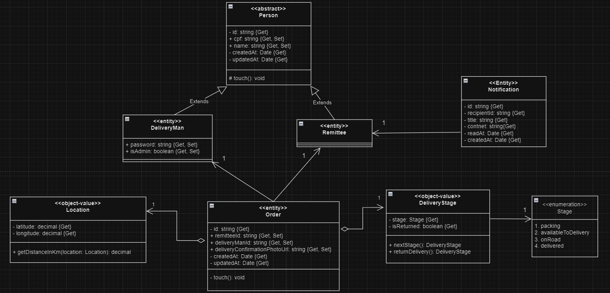

# DESAFIO: FastFeet

O desafio consiste em desenvolver uma API para controle de encomendas de uma transportadora fictícia, a FastFeet.

## Conceitos á pratica

- DDD, Domain Events, Clean Architecture

- Autenticação e Autorização (RBAC)

- Testes unitários e e2e

- Integração com serviços externos

## Regras da aplicação

- [x] A aplicação deve ter dois tipos de usuário, entregador e/ou admin

- [x] Deve ser possível realizar login com CPF e Senha

- [x] Deve ser possível realizar o CRUD dos entregadores

- [x] Deve ser possível realizar o CRUD das encomendas

- [x] Deve ser possível realizar o CRUD dos destinatários

- [x] Deve ser possível marcar uma encomenda como aguardando (Disponível para retirada)

- [x] Deve ser possível retirar uma encomenda

- [x] Deve ser possível marcar uma encomenda como entregue

- [x] Deve ser possível marcar uma encomenda como devolvida

- [x] Deve ser possível listar as encomendas com endereços de entrega próximo ao local do entregador

- [x] Deve ser possível alterar a senha de um usuário

- [x] Deve ser possível listar as entregas de um usuário

- [x] Deve ser possível notificar o destinatário a cada alteração no status da encomenda

## Regras de negócio

- [x] Somente usuário do tipo admin pode realizar operações de CRUD nas encomendas

- [x] Somente usuário do tipo admin pode realizar operações de CRUD dos entregadores

- [x] Somente usuário do tipo admin pode realizar operações de CRUD dos destinatários

- [x] Para marcar uma encomenda como entregue é obrigatório o envio de uma foto

- [x] Somente o entregador que retirou a encomenda pode marcar ela como entregue

- [x] Somente o admin pode alterar a senha de um usuário

- [x] Não deve ser possível um entregador listar as encomendas de outro entregador

# Teste a aplicação em sua máquina

Certifique-se de ter o Docker e o Node.js instalados em sua máquina antes de prosseguir.

- [Docker](https://www.docker.com/)
- [Node.js](https://nodejs.org/)

1. Faça o clone do projeto

```bash
git clone https://github.com/marcosparreiras/ignite-node-stage04-challenge-01.git
```

2. Navegue até diretório do projeto e instale as dependências com o comando:

```bash
npm install
```

3. Renomeie o arquivo `.sample.env` para `.env` e complete as variaveis de ambiente com informações válidas

4. Suba o banco de dados utilizando Docker Compose:

```bash
docker compose up -d
```

5. Inicie a aplicação em modo de desenvolvimento:

```bash
npm run dev
```

ou, rode os testes de unidade com o comando:

```bash
npm run test
```

ou, rode os testes end-to-end com o comando:

```bash
npm run test:e2e
```

# Endpoints

### Entregadores

| Método | Rota                  | Necessário autorização | Restrito a administradores | Descrição                                                                       |
| ------ | --------------------- | ---------------------- | -------------------------- | ------------------------------------------------------------------------------- |
| POST   | /delivery-men/session | ❌                     | ❌                         | Inicia a sessão de um entregador na aplicação e retorna um token de autorização |
| POST   | /delivery-men         | ✅                     | ✅                         | Cria um novo entregador na aplicação                                            |
| GET    | /delivery-men         | ✅                     | ✅                         | Retorna uma lista de entregadores                                               |
| GET    | /delivery-men/:id     | ✅                     | ✅                         | Retorna os dados de um entregador específico                                    |
| PUT    | /delivery-men/:id     | ✅                     | ✅                         | Atualiza os dados de um entregador específico                                   |
| DELETE | /delivery-men/:id     | ✅                     | ✅                         | Deleta um entregador específico da aplicação                                    |

---

#### POST /delivery-men/session

##### Body

```json
{
  "cpf": "00000000000",
  "password": "123456"
}
```

---

#### POST /delivery-men

##### Headers

```bash
Authorization: Beaer token
```

##### Body

```json
{
  "cpf": "00000000000",
  "name": "John Doe",
  "password": "123456"
}
```

---

#### GET /delivery-men

##### Headers

```bash
Authorization: Beaer token
```

##### Search params

```bash
page=1
```

---

#### GET /delivery-men/:id

##### Headers

```bash
Authorization: Beaer token
```

---

#### PUT /delivery-men/:id

##### Headers

```bash
Authorization: Beaer token
```

##### Body

```json
{
  "name": "John Doe",
  "isAdmin": false,
  "password": "123456"
}
```

---

#### DELETE /delivery-men/:id

##### Headers

```bash
Authorization: Beaer token
```

---

### Destinatários

| Método | Rota           | Necessário autorização | Restrito a administradores | Descrição                                       |
| ------ | -------------- | ---------------------- | -------------------------- | ----------------------------------------------- |
| POST   | /remittees     | ✅                     | ✅                         | Cria um novo destinatário na aplicação          |
| GET    | /remittees     | ✅                     | ✅                         | Retorna uma lista de destinatários              |
| GET    | /remittees/:id | ✅                     | ✅                         | Retorna os dados de um destinatário específico  |
| PUT    | /remittees/:id | ✅                     | ✅                         | Atualiza os dados de um destinatário específico |
| DELETE | /remittees/:id | ✅                     | ✅                         | Deleta um destinatário específico da aplicação  |

---

#### POST /remittees

##### Headers

```bash
Authorization: Beaer token
```

##### Body

```json
{
  "cpf": "00000000000",
  "name": "John Doe"
}
```

---

#### GET /remittees

##### Headers

```bash
Authorization: Beaer token
```

##### Search params

```bash
page=1
```

---

#### GET /remittees/:id

##### Headers

```bash
Authorization: Beaer token
```

---

#### PUT /remittees/:id

##### Headers

```bash
Authorization: Beaer token
```

##### Body

```json
{
  "name": "John Doe"
}
```

---

#### DELETE /remittees/:id

##### Headers

```bash
Authorization: Beaer token
```

---

### Pedidos

| Método | Rota                                  | Necessário autorização | Restrito a administradores | Descrição                                                                                                                                                  |
| ------ | ------------------------------------- | ---------------------- | -------------------------- | ---------------------------------------------------------------------------------------------------------------------------------------------------------- |
| GET    | /orders/:cpf                          | ❌                     | ❌                         | Retrorna os dados dos pedidos de um destinatário específico                                                                                                |
| GET    | /orders/my/nearby                     | ✅                     | ❌                         | Retorna uma lista de pedidos que possuem destino próximo a uma localização, retorna apenas dados dos pedidos atribuidas ao entregador que faz a requisição |
| GET    | /orders/my                            | ✅                     | ❌                         | Retrorna os dados dos pedidos de um entregador específico                                                                                                  |
| POST   | /orders                               | ✅                     | ✅                         | Cria um novo pedido na aplicação                                                                                                                           |
| GET    | /orders                               | ✅                     | ✅                         | Retorna uma lista de pedidos                                                                                                                               |
| GET    | /orders/:id                           | ✅                     | ✅                         | Retorna os dados de um pedido específico                                                                                                                   |
| PUT    | /orders/:id                           | ✅                     | ✅                         | Atualiza os dados de um pedido específico                                                                                                                  |
| DELETE | /orders/:id                           | ✅                     | ✅                         | Deleta os dados de um pedido específico                                                                                                                    |
| PATCH  | /orders/:id/delivery-stage            | ✅                     | ❌                         | Atualiza a etapa da entrega de um pedido específico. (Rota restrita ao entregador responsável pela entrega)                                                |
| PATCH  | /orders/:id/return                    | ✅                     | ❌                         | Marca um pedido específico como devol. (Rota restrita ao entregador responsável pela entrega)                                                              |
| PATCH  | /orders/:id/upload-confirmation-photo | ✅                     | ❌                         | Faz o upload da foto de confirmação da entrega. (Rota restrita ao entregador responsável pela entrega)                                                     |

---

#### GET /orders/:cpf

##### Search params

```bash
page=1
```

---

#### GET /orders/my/nearby

##### Headers

```bash
Authorization: Beaer token
```

##### Search params

```bash
page=1&latitude=-19.94765332605529&longitude=-43.94034520061096
```

#### GET /orders/my

##### Headers

```bash
Authorization: Beaer token
```

##### Search params

```bash
page=1
```

#### POST /orders

##### Headers

```bash
Authorization: Beaer token
```

##### body

```json
{
  "remitteeId": "8b54d4d8-2ba1-45d1-b44c-f9a7ab81ccf9",
  "deliveryManId": "c8f2fd76-ff7b-4a88-b187-99f90a93f4d0",
  "latitude": -19.94765332605529,
  "longitude": -43.94034520061096
}
```

---

#### GET /orders

##### Headers

```bash
Authorization: Beaer token
```

##### Search params

```bash
page=1
```

---

#### GET /orders/:id

##### Headers

```bash
Authorization: Beaer token
```

---

#### PUT /orders/:id

##### Headers

```bash
Authorization: Beaer token
```

```json
{
  "remitteeId": "8b54d4d8-2ba1-45d1-b44c-f9a7ab81ccf9",
  "deliveryManId": "c8f2fd76-ff7b-4a88-b187-99f90a93f4d0",
  "latitude": -19.94765332605529,
  "longitude": -43.94034520061096
}
```

---

#### DELETE /orders/:id

##### Headers

```bash
Authorization: Beaer token
```

---

#### PATCH /orders/:id/delivery-stage

##### Headers

```bash
Authorization: Beaer token
```

##### body

```json
{
  "deliveryStage": "AVAILABE_TO_DELIVERY"
}
```

---

#### PATCH /orders/:id/return

##### Headers

```bash
Authorization: Beaer token
```

---

#### PATCH /orders/:id/upload-confirmation-photo

##### Headers

```bash
Authorization: Beaer token
Content-Type: multipart/form-data
```

#### form-data

```bash
key="file"
value="./some-dir/file-name.png"
```

---

### Notificações

| Método | Rota               | Necessário autorização | Restrito a administradores | Descrição                              |
| ------ | ------------------ | ---------------------- | -------------------------- | -------------------------------------- |
| POST   | /notifications/    | ✅                     | ❌                         | Envia uma notificação para um usário   |
| PATCH  | /notifications/:id | ❌                     | ❌                         | Marca uma notificação como visualizada |

---

#### POST /notifications

##### Headers

```bash
Authorization: Beaer token
```

##### body

```json
{
  "recipientId": "8b54d4d8-2ba1-45d1-b44c-f9a7ab81ccf9",
  "title": "Order Delivery Confirmation",
  "content": "Dear John Doe. We are pleased to inform you that your order has been successfully delivered! We hope the products meet your expectations and that you have a great experience with our company."
}
```

---

#### PATCH /notifications/:id

##### body

```json
{
  "recipientId": "8b54d4d8-2ba1-45d1-b44c-f9a7ab81ccf9"
}
```

# Diagrama de classes


